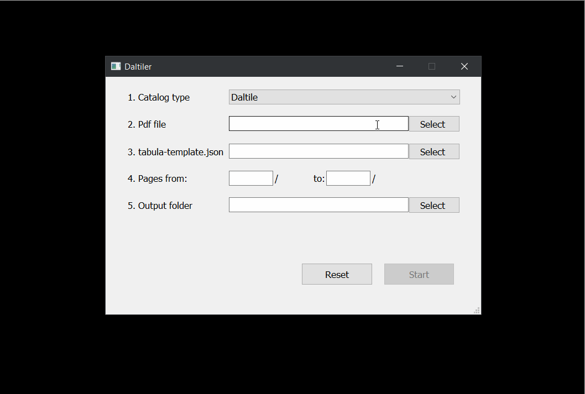

# daltiler
`daltiler` is a desktop application using Qt for Python, packaged with pyInstaller.

It is intended to automate data entry into the ERP system from pdf catalogue of one specific vendor.
 
Because the pdf catalog is also the price-list `daltiler` is used each time the pdf catalog is updated.

`daltiler` uses 
- tabula-java as an engine for reading the pdf file in several modes. 
- tabula-python as an interface to python language.
- Qt for python as gui library.
- Qt threads to separate GUI from background process
- python threads and atomic queue to speed up background i/o bound processing

## Requirements
- Java 8
- Windows 10, 64-bit
- System PATH variable set for Java runtime environment
- Tabula

Java installation links:  
https://www.java.com/en/download/  
https://www.java.com/en/download/help/path.html
Tabula installation link:  
https://tabula.technology/

## Usage
Before running `daltiler2`, export tabula-template.json of the pdf catalog with the help of Tabula for Windows. Use autodetect tables to create tabula-template.json. Save template in the same directory with the program.

## Input
pdf file containing pages with tables from Daltile catalog
tabula-template.json file

## Output
product_table.csv - *structured data extracted from all fields of tables*   
target.csv - *client's template for upload in ERP*  
uom.csv - *another client's template containing units conversion for upload in ERP*  

