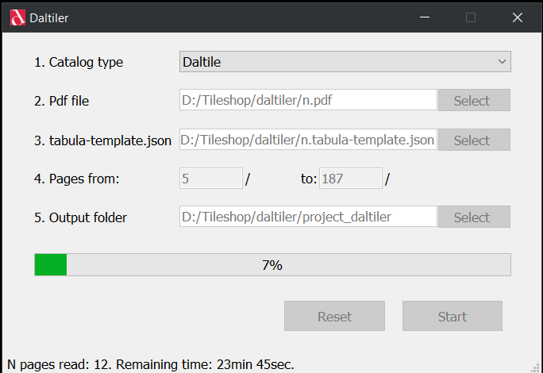

# daltiler
`daltiler` is a desktop application to automate data entry into ERP system from pdf catalogue of one specific vendor.
 
Because the pdf catalog is also a price-list `daltiler` is used each time pdf catalog is updated.

`daltiler` uses 
- tabula-java as an engine for text extraction from pdf. 
- tabula-python as an interface to python language.
- python and pandas for data transformation
- Qt for python as gui library.
- Qt threads to separate GUI from background process
- python threads and atomic queue to speed up background i/o bound processing

## Requirements
- Java 8
- Windows 10, 64-bit
- System PATH variable set for Java runtime environment
- Tabula

Java installation links:  
https://www.java.com/en/download/  
https://www.java.com/en/download/help/path.html
Tabula installation link:  
https://tabula.technology/

## Usage
Before running `daltiler2`, export tabula-template.json of the pdf catalog with the help of Tabula for Windows. Use autodetect tables to create tabula-template.json. Save template in the same directory with the program.

## Input
- pdf file containing pages with tables from Daltile catalog
- tabula-template.json file

## Output
product_table.csv - *structured data extracted from all fields of tables*   
target.csv - *client's template for ERP*  
uom.csv - *another client's template containing units conversion for ERP* 
